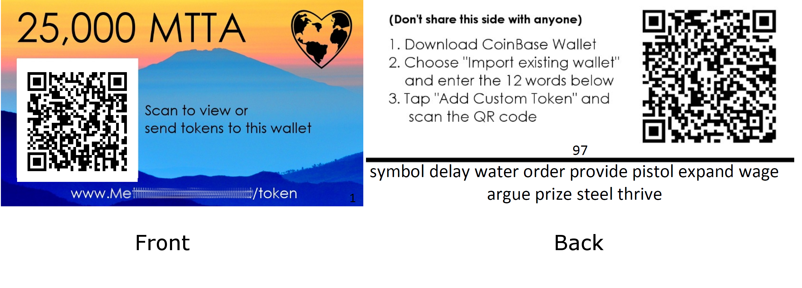

<p align="center"></p>

<h1 align="center"> Walrus Paper Wallet Generator </h1>
</p>

Generate and fund hundreds of paper wallets, for a workshop or in-person giveaway :globe_with_meridians: :loudspeaker: :moneybag: :gift:  :chart_with_upwards_trend:

> :warning: Warning! Do not use for high-security needs. You should not assume cryptographic security.

<p align="center">
</p>

## About

Paper wallets are an **easy way to drive adoption** :rocket: since they introduce cryptography, while still _feeling like_ physical, fiat currency. These resources are designed to create and print hundreds of paper wallets on standard business cards.

Read the Medium article on [key wallet concepts for blockchain education](https://medium.com/@pi0neerpat/walrus-paper-wallet-5c39b89c9e22).

## Features
:white_check_mark: Quickly generate a **.csv**  file with the mnemonic seed, public and private keys for many wallets.:zap:

:white_check_mark: Business-card template  :clipboard:

:white_check_mark: Auto-populate labels with mnemonic phrase using Word mail merge  :mailbox_with_mail:  :arrow_right:

:white_check_mark: QR addresses :camera:

:white_check_mark: Directions for users

## Instructions

Here is the general flow.

<p align="center">
</p>

### Step 1. Generate wallets

Install
```
npm install
```
Generate the wallets.csv file
```
node generateWallets.js
```
#### Here's what's in wallets.csv

| index | mnemonic | privateKey | publicAddress | publicAddressFormatted |  publicAddressQRString |
| ----- | --------------------------- | -------------- | ----------- | ------| ------|
| 1     | push loan... | a6de7...    | 0x952d81...  | "0xa88...32c7c8", | ethereum:0xa88ed... |

- **publicAddressFormatted** takes care of our `batch.sol` function argument syntax.
- **publicAddressQRString** is the seed text to generate a QR code in Word mail-merge.

This is a good time to mention that many new cryptography users and developers struggle with the concept that a blockchain wallet does not "contain" any tokens or funds. Its merely a text file that is used to sign messages. Consider using an icon like this  to describe the concept visually.

### Step 2. Create business-cards in Word using Mail-Merge

I've included an example of my mail-merge fields in `wallets.docx`. To import your wallet data, open "Mailings" in the ribbon, then "Select Recipients" and select the file `wallets.csv`.  Use this [wiki-how tutorial](https://www.wikihow.com/Mail-Merge-in-Microsoft-Word) if you need help. Feel free to create your own template.

Note: I highly recommend you include the **index** on each card, to help during printing, funding, and distribution.

<p align="center">
</p>

#### :camera: QR Codes

I've spared you from installing spyware-riddled plugins to help you generate QR codes in Word. Just use the following mail-merge code.
```js
{DSPLAYBARCODE "{MERGEFIELD publicAddressQRString}" QR \* MERGEFORMAT \s 55}
```
Change the size by editing the number at the end.

#### :clipboard: Directions  for Users  

Here is an example from a in-person event, with users importing their paper wallet into a mobile wallet to exchange.

<p align="center"></p>

Note: CoinBase wallet on iOS does not currently support starting a *new* wallet from 12-word phrase. Try [Enjin](https://itunes.apple.com/us/app/enjin-cryptocurrency-wallet/id1349078375).

For in-person workshops, I do not include any instructions.

#### :see_no_evil: Printing can be a nightmare  

Here's what I learned:

- Your **neighborhood printers are too lazy** :zzz: to do anything besides cookie-cutter job. They are **highly unlikely to accept** your business card prints, even if you do a good job explaining the details.
- Online business-card services **don't allow you to configure unique cards**. If you find one, let me know!

The only option is to print it yourself.
- Buy some plain cardstock and print at home or local mail-service center.
- Invest or borrow a good paper-trimmer if you have 200+ cards, otherwise you can cut by hand.
- If you decide to print double-sided, be sure that the data on the **front and backs are mirrored horizontally**. Test on a small batch to ensure that the publicAddress on the front matches the mnemonic on the back.

### Step 3. Fund your Wallets


#### Here's a snippet of what you'll be using in `batch.sol`

(batch.sol is adapted from my [Eth-Splitter tool](https://github.com/blockchainbuddha/Eth-Splitter-Tool))

```solidity
function multisendETH(address[] _to) public payable returns (bool _success) {
  uint splitAmount = msg.value / _to.length;
  for (uint i = 0; i < _to.length; i++) {
    _to[i].transfer(splitAmount);
  }
  return true;
}

function multisendToken(address _tokenAddr, address[] _to, uint _value, uint limit) public payable
returns (bool _success) {
  require(_to.length <= limit);
  for (uint i = 0; i < _to.length; i++) {
    require((Token(_tokenAddr).transferFrom(msg.sender, _to[i], _value)) == true);
  }
  return true;
}
```
Open `wallets.csv` and copy/paste the column **publicAddressFormatted** into a blank text document.

Add square brackets and remove the last comma. It should look like this:

```js
["0xa88ede6e85a2a983e56d26127aed64713362c7c8",
"0x554fa034b8de09da43e19b98e8705d842f3d7b91",
"0x10f7343ce9ed56bd7e9910446ecea6a0484bf726",
"0x9956363ee036640f78fd4a21e468f34278e21227"]
```

Now you have a properly formatted argument to call the `multiSendETH` function in the `batch.sol` contract.

> Note, keep in mind there is a global gas limit for transactions. Try breaking addresses up into batches of 100 if you run into problems.

Deploy the `batch.sol` contract on the appropriate network using [Remix IDE](http://remix.ethereum.org). Next, call the `multiSendETH` function using the arguments you just created, along with the desired ETH value to split.

I'll leave the `multiSendToken` function for you to solve on your own. Good luck!


### Step 4. Hand them out and have fun!

 :globe_with_meridians: :loudspeaker: :moneybag: :gift:  :chart_with_upwards_trend:

 ---------------------------------
 ## Did you find this useful?  Give this repo a :star:

Connect with me on twitter: [Pi0neerPat](https://twitter.com/pi0neerpat)
